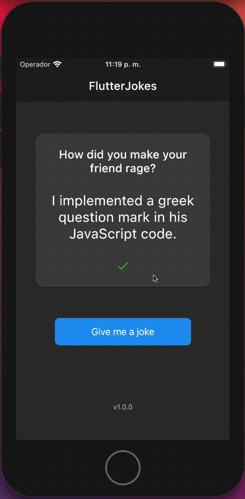
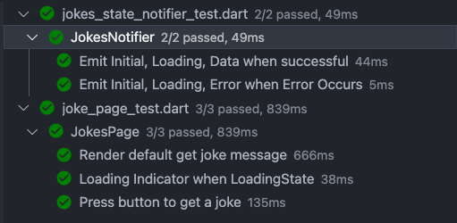
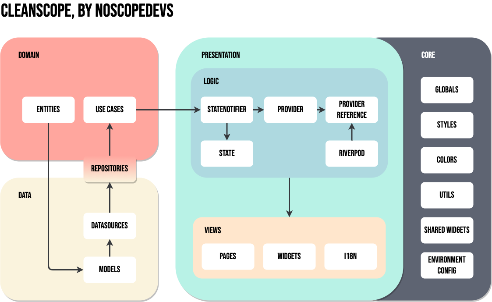

# flutter_bluetooth_scanner by Elian Ortega

A flutter application that will make you laugh with some developer jokes.

- ✅  Null Safety
- ✅  Clean Architecture
- ✅  Riverpod
- ✅  Basic Testing
- ✅  Internationalization

## To get started 
```
// To start run the following commands 

git clone [repo_url]

cd flutter_jokes

flutter pub get

flutter run --dart-define apiUrl=https://v2.jokeapi.dev
```
## App Preview
 
 


## Simple Testing
### ✅ Unit Test
### ✅ Widget Test

```dart
//run the following command to run the widget test
flutter test
```
## Project Structure - Clean Architecture

The following diagram represents the clean architecture approach taken to solve this challenge. This was proposed by myself and a friend and was shared with the Hispanic community as a solution to follow clean architecture practices. The original proposal uses `riverpod` but because of the `decoupling` there is no problem adapting to other state manager solution like `flutter_bloc` or basic  `provider`.

With this approach we achieve a great decoupling and separation of concerns between the different layers of the application.


